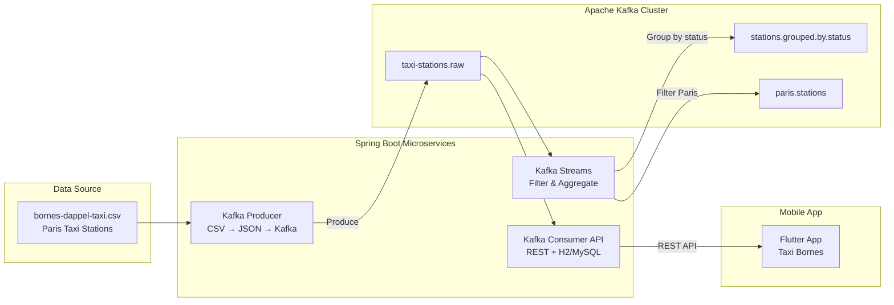

# Kafka Taxi Stations Pipeline

> Real-time data pipeline processing Paris taxi station data using Apache Kafka, with a Spring Boot producer, a Kafka Streams processor, a consumer API backed by H2/MySQL, and a Flutter mobile application for visualization.


## Architecture



## Features

- **Kafka Producer**: reads taxi station CSV data, maps to JSON, publishes to `taxi-stations.raw` topic
- **Kafka Streams**: real-time stream processing — groups stations by status and filters Paris-only stations
- **Kafka Consumer API**: Spring Boot REST API consuming messages and persisting to H2 or MySQL
- **Flutter mobile app**: cross-platform application displaying taxi stations with list, detail, and map views
- **Data preparation**: CSV cleaning and transformation pipeline for raw open data

## Tech Stack

| Category | Technology |
|----------|-----------|
| Messaging | Apache Kafka 3.9 |
| Backend | Spring Boot 3.4, Spring Kafka |
| Stream Processing | Kafka Streams API |
| Language (Backend) | Java 23 |
| Database | H2 (dev) / MySQL (prod) |
| Mobile | Flutter / Dart |
| Data Format | CSV → JSON |
| Build Tool | Maven |

## Getting Started

### Prerequisites

- Java 23+
- Apache Kafka (local or Docker)
- Maven 3.8+
- Flutter SDK (for mobile app)

### Installation

```bash
git clone https://github.com/g-holali-david/kafka-project.git
cd kafka-project

# 1. Start Kafka (ZooKeeper + Broker)
# On Windows:
.\bin\windows\zookeeper-server-start.bat .\config\zookeeper.properties
.\bin\windows\kafka-server-start.bat .\config\server.properties

# 2. Create topics
kafka-topics.sh --create --bootstrap-server localhost:9092 \
  --topic taxi-stations.raw --partitions 1 --replication-factor 1

# 3. Start the Producer
cd applications/kafka-producer
./mvnw spring-boot:run

# 4. Start Kafka Streams processor
cd ../kafka-streams
./mvnw spring-boot:run

# 5. Start the Consumer API
cd ../kafka-consumer-api
./mvnw spring-boot:run

# 6. Start the Flutter app
cd ../taxi_bornes_app
flutter pub get && flutter run
```

## Project Structure

```
kafka-project/
├── applications/
│   ├── kafka-producer/                # CSV reader → Kafka producer
│   │   ├── pom.xml
│   │   └── src/.../kafka_producer/
│   │       ├── controller/TaxiStationController.java
│   │       ├── model/TaxiStationCsv.java & TaxiStationJson.java
│   │       └── service/CsvReader, KafkaSender, TaxiStationMapper
│   ├── kafka-streams/                 # Stream processing app
│   │   ├── pom.xml
│   │   └── src/.../kafka_streams/
│   │       ├── config/KafkaStreamsConfig.java
│   │       ├── processor/TaxiStationStreamProcessor.java
│   │       └── utils/KafkaTopicCreator.java
│   ├── kafka-consumer-api/            # Consumer + REST API
│   │   ├── pom.xml
│   │   └── src/.../kafka_consumer_api/
│   │       ├── controllers/TaxiStationController.java
│   │       ├── models/TaxiStationEntity & TaxiStationJson
│   │       ├── services/KafkaConsumerService.java
│   │       └── repositories/TaxiStationRepository.java
│   └── taxi_bornes_app/               # Flutter mobile application
│       ├── pubspec.yaml
│       └── lib/
│           ├── main.dart
│           ├── screens/               # Home, List, Detail, Map
│           ├── models/station.dart
│           └── services/api_service.dart
├── data-preparation/                  # Raw + cleaned CSV data
├── project-data/                      # Source datasets
├── project-files/                     # Reports and presentations
└── documentation/kafka-doc.md         # Kafka commands reference
```

## Author

**Holali David GAVI** — Cloud & DevOps Engineer
- Portfolio: [hdgavi.dev](https://hdgavi.dev)
- GitHub: [@g-holali-david](https://github.com/g-holali-david)
- LinkedIn: [Holali David GAVI](https://www.linkedin.com/in/holali-david-g-4a434631a/)

## License

MIT
